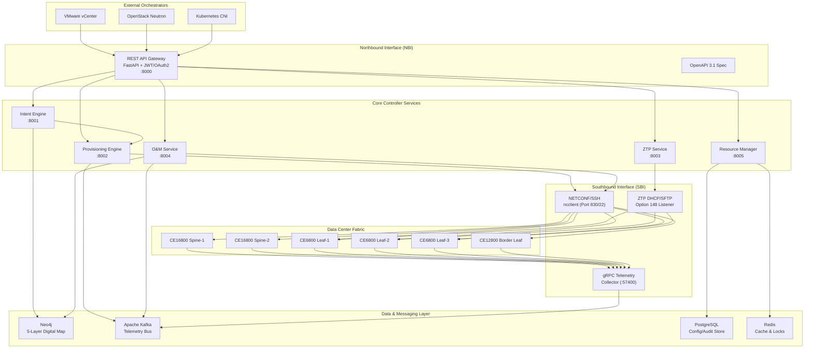
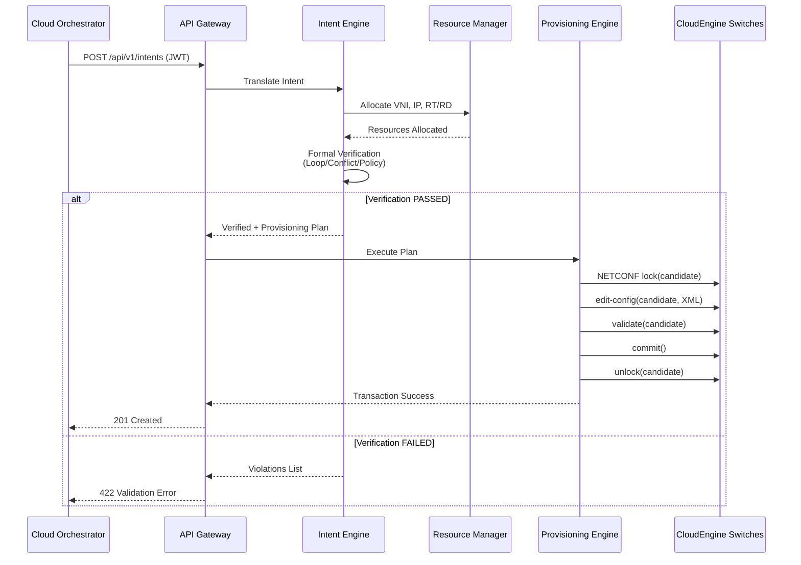
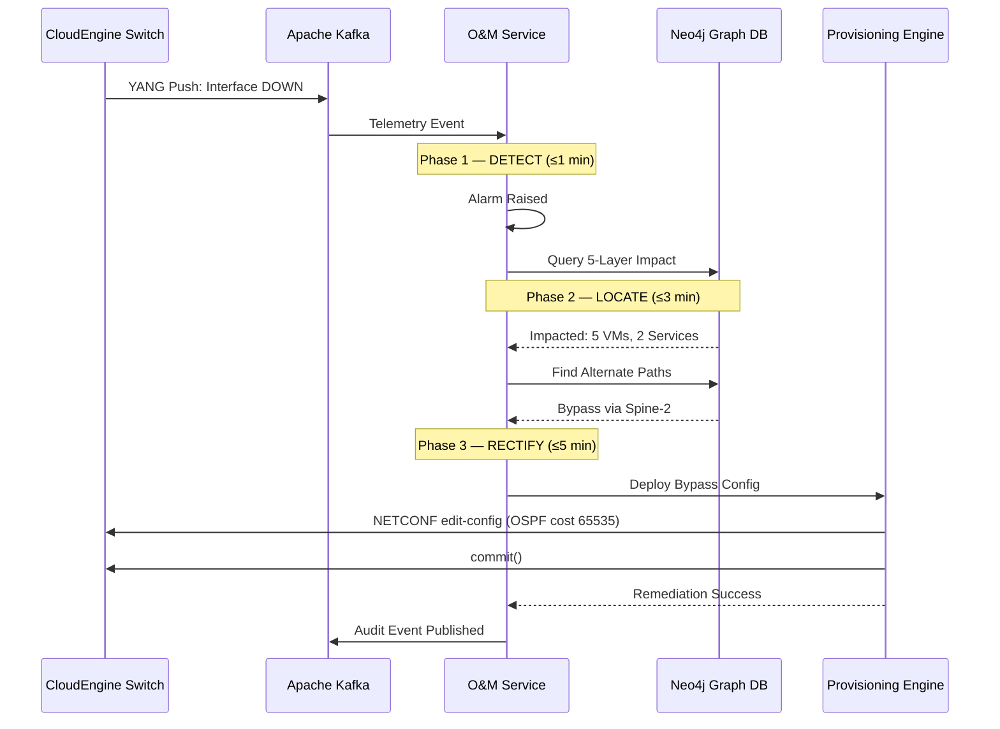
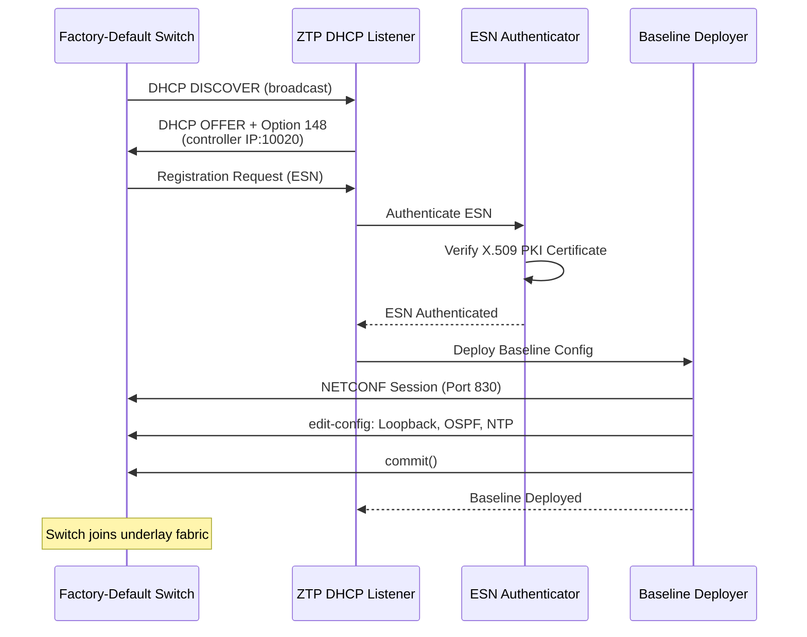
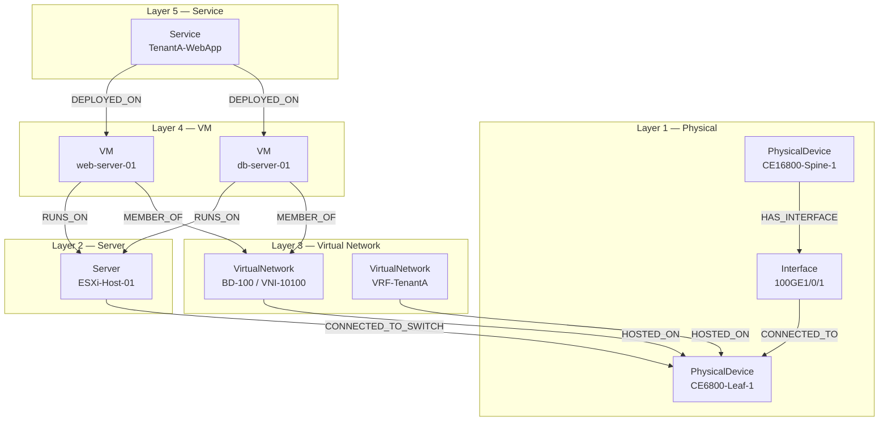

# High-Level Architecture — Gravity SDN

## CloudEngine IDN Automation Platform

> **Level 3+ Autonomous Driving Network Controller** for Huawei CloudEngine data-center fabrics.

---

## Architecture Overview



---

## Interaction Flows

### Flow 1: Intent-to-Provisioning Pipeline



### Flow 2: 1-3-5 Troubleshooting Framework



### Flow 3: Zero Touch Provisioning



---

## 5-Layer Network Digital Map (Neo4j)



---

## Microservice Ports

| Service | Port | Description |
|---------|------|-------------|
| API Gateway | 8000 | REST NBI with JWT auth, Swagger UI |
| Intent Engine | 8001 | Intent translation & formal verification |
| Provisioning Engine | 8002 | ACID NETCONF transactions |
| ZTP Service | 8003 | Zero Touch Provisioning |
| O&M Service | 8004 | 1-3-5 AI troubleshooting |
| Resource Manager | 8005 | IPAM, VNI, RT/RD allocation |
| Neo4j | 7474/7687 | Graph database (Browser / Bolt) |
| Kafka | 9092 | Telemetry message broker |
| PostgreSQL | 5432 | Config & audit store |
| Redis | 6379 | Cache & distributed locks |

---

## NETCONF Transaction Model (ACID)

```
┌──────────┐    ┌───────────────┐    ┌──────────┐    ┌────────┐    ┌──────────┐
│  lock()  │───▶│ edit-config() │───▶│validate()│───▶│commit()│───▶│ unlock() │
│candidate │    │  candidate    │    │candidate │    │        │    │candidate │
└──────────┘    └───────────────┘    └──────────┘    └────────┘    └──────────┘
                        │                   │              │
                        ▼                   ▼              ▼
                 ┌──────────────┐   ┌──────────────┐  ┌───────────┐
                 │ RPCError?    │   │ RPCError?    │  │ RPCError? │
                 │ discard()  ──┼──▶│ discard()  ──┼─▶│ discard() │
                 │ unlock()    │   │ unlock()    │  │ unlock()  │
                 └──────────────┘   └──────────────┘  └───────────┘
```

---

## Huawei YANG Namespaces

| Model | Namespace URI | Usage |
|-------|---------------|-------|
| huawei-bgp | `urn:huawei:params:xml:ns:yang:huawei-bgp` | BGP EVPN overlay |
| huawei-evpn | `urn:huawei:params:xml:ns:yang:huawei-evpn` | EVPN instances, RD/RT |
| huawei-nvo3 | `urn:huawei:params:xml:ns:yang:huawei-nvo3` | NVE/VTEP, VNI members |
| huawei-bd | `urn:huawei:params:xml:ns:yang:huawei-bd` | Bridge Domains |
| huawei-network-instance | `urn:huawei:params:xml:ns:yang:huawei-network-instance` | VRF / VPN instances |
| huawei-ifm | `urn:huawei:params:xml:ns:yang:huawei-ifm` | Interface management |
| huawei-ip | `urn:huawei:params:xml:ns:yang:huawei-ip` | IP addressing |
| huawei-ospf | `urn:huawei:params:xml:ns:yang:huawei-ospf` | Underlay OSPF |
